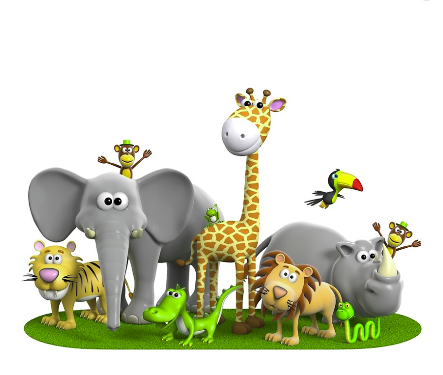
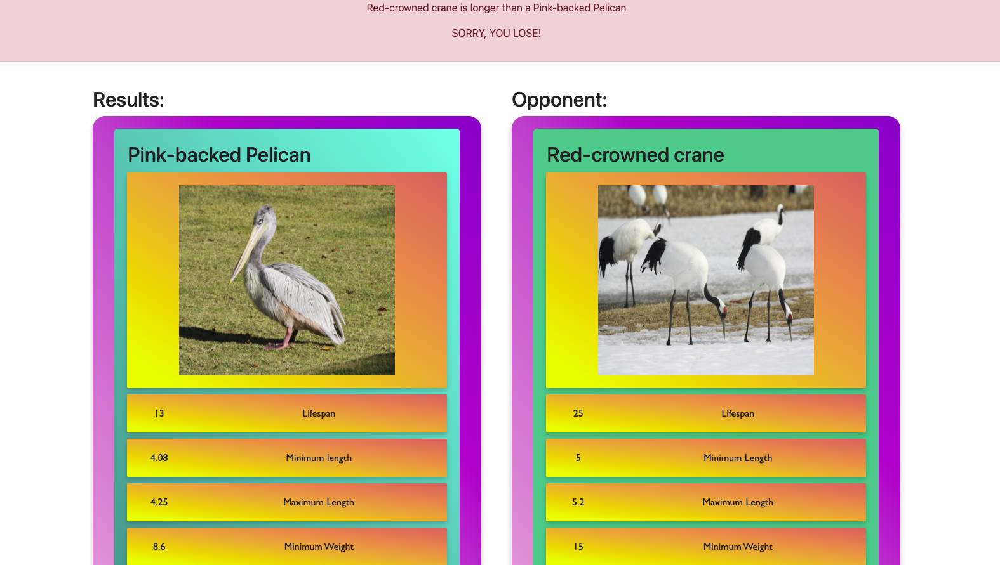

<br />
<p align="center">
    </p>

## <p align="center"><strong>Animal Top Trumps</strong>
<p align="center">
    CFG FINAL PROJECT<br>
An interactive and fun Animal Top Trumps game!<br>
<a href="https://github.com/hanmat44/CFGFinalProject"><i>Link to Github</i></a>
<a href="https://github.com/hanmat44/CFGFinalProject.git"><i><br>Clone Repository</i></a>
    </p>

### What is Animal Top Trumps?

An interactive, fun and educational game for children.

The aim of the game is to pick the highest or lowest statistic to win, depending on your chosen category.

You can either Win, Draw or Lose, against the computer.

A great creative and educational resource for children. Game is single player, which means you can play anytime, anywhere, whilst learning new facts and beating boredom.

### Example Image of Game:
<br>
<p align="center">
    
  </p>

### How to get started:

To get a local copy to run, install the following packages using pip:

- Flask
  ```sh
  pip install flask
  
- Requests
  ```sh
  pip install requests
  
- SQL Connector
  ```sh
  pip install mysql.connector

***Please make sure all files/images are in one project folder before running.***

Run from new_game.py and click on local server at the bottom to load in web-browser.

If running off a MacBook, please make sure Airplay receiver is disabled under sharing, system preferences.
As this can sometimes block the required port. 

### Gameplay

Press the 'Start' button to enter the game and view your randomly generated animal card.
Choose your desired stat and click the button to see the results.

If your Animals Lifespan, Maximum length or Maximum weight is higher than the computer, you win!

Alternatively if your Animals Minimum length or Minimum weight is lowest, you win!

Click the 'Play Again' button to play more rounds.

### Database 

To use the database functionality of the game you must first:

Create a config.py python that includes the following:<br>

    
    USER = 'root'
    HOST = 'localhost'
    PASSWORD = 'your password for my_sql'

Then run the following code in MySQL:<br>

    CREATE database toptrumps; 

    USE toptrumps;

    CREATE table TotalScores(
        player varchar(255),
      score int
      );

    INSERT INTO TotalScores
    (player, score)
    VALUES
    ('person',0),
    ('computer',0);

You are now ready to run the sql component of the game.

After you have played as many rounds as you would like, please run check_scores to see your final score. The scores will then be reset.

### Video Demo:

https://user-images.githubusercontent.com/102698430/200124243-109e3982-9ebf-4198-87a5-1009a3dd6f14.mov


### Creators:

Hannah Mathews, Kathryne Ellinger, Louise Miller, Libby Galletly, Amina Ganni

### Link to Resources:

- [Bootstrap](https://getbootstrap.com)
- [Flask](https://flask.palletsprojects.com)
- [Zoo Animal API](https://zoo-animal-api.herokuapp.com)
- [PyCharm](https://www.jetbrains.com/pycharm/)

### Acknowledgements:

#### Original HTML/CSS Templates (Before Altering)
- [Bootstrap](https://getbootstrap.com)
- [Github Inspiration](https://github.com/catprior?tab=repositories)

#### Images
- [Zoo Animal API](https://zoo-animal-api.herokuapp.com)
- [Wikipedia Zoo Animal Images](https://www.wikipedia.com)
- [Safari Image Logo](https://ih0.redbubble.net/image.366065656.8788/flat,1000x1000,075,f.u3.jpg)


